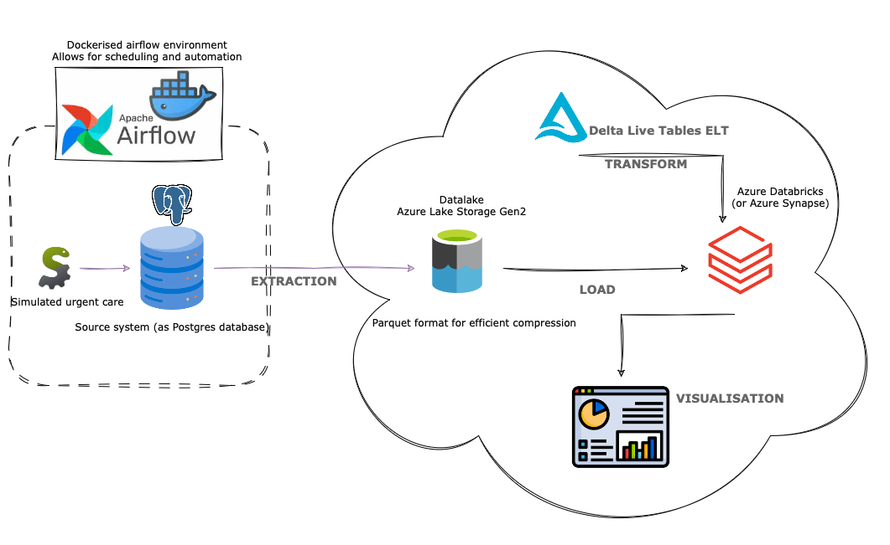

# Simulation Orechestration - Data Engineering Project - Part 1

This repository contains the code and configuration for the first part of a data engineering project. The focus is on setting up a SimPy discrete event simulation, orchestrating it using Airflow within a Docker container, and managing data flow to and from PostgreSQL and Azure Data Lake Storage Gen2. This mimics the process of obtaining data from a backend system and placing it to a centralised place.

## Project Overview

The project workflow can be summarized as follows:

1. **SimPy Discrete Event Simulation**:
   - A simulation using the SimPy library is executed to generate data.
   - The simulation results are stored in a PostgreSQL database.
   - A more detailed overview of the simulation model and how it was developed can be found [here](https://ya5s3r-discrete-event-sim-app-hello-oykuyx.streamlit.app)

2. **Airflow Orchestration**:
   - Apache Airflow is used to orchestrate the simulation and data processing tasks.
   - Airflow runs inside a Docker container for easy deployment and management.
   - The Airflow DAG schedules the simulation to run at regular intervals (daily).

3. **Data Management**:
   - After the simulation completes, the DAG extracts the data from PostgreSQL.
   - The data is then uploaded to an Azure Data Lake Storage Gen2 container.
   - Docker secrets are utilized to securely store the connection string for the Azure storage account.

## Project Architecture

This repo includes code for the first part of the below diagram upto and including the Azure gen2 storage upload.

## Getting Started

After cloning the repo and having Docker installed locally, the only local file you need is a file contianing the connection
string to your Azure gen2 storage. This can be found under *Access keys* in the gen2 account.
This needs to be saved in a file in root directory of this project named *azure_secret.txt*

It is useful to use *Docker secrets* as described here... https://docs.docker.com/engine/swarm/secrets/

## Part 2

The second part of this project will focus on the ELT and datamodel development using Delta Live Tables in Azure
Databricks!

Keep an eye out for that!